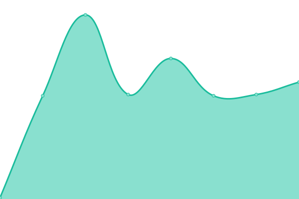

# [📈 Live Status](https://status.playerdata.co.uk): <!--live status--> **🟩 All systems operational**

This repository contains the open-source uptime monitor and status page for [PlayerData](https://www.playerdata.co.uk) services, powered by [Upptime](https://github.com/upptime/upptime).

<!--start: status pages-->
<!-- This summary is generated by Upptime (https://github.com/upptime/upptime) -->
<!-- Do not edit this manually, your changes will be overwritten -->
<!-- prettier-ignore -->
| URL | Status | History | Response Time | Uptime |
| --- | ------ | ------- | ------------- | ------ |
|  [PlayerData API](https://app.playerdata.co.uk/api/liveness) | 🟩 Up | [player-data-api.yml](https://github.com/PlayerData/playerdata-status/commits/HEAD/history/player-data-api.yml) | 

 657ms
     
 | 

<a href="https://status.playerdata.co.uk/history/player-data-api">100.00%</a>
    

|  [PlayerData Web App](https://app.playerdata.co.uk) | 🟩 Up | [player-data-web-app.yml](https://github.com/PlayerData/playerdata-status/commits/HEAD/history/player-data-web-app.yml) | 

 98ms
     
 | 

<a href="https://status.playerdata.co.uk/history/player-data-web-app">100.00%</a>
    

|  [PlayerData Website](https://www.playerdata.co.uk) | 🟩 Up | [player-data-website.yml](https://github.com/PlayerData/playerdata-status/commits/HEAD/history/player-data-website.yml) | 

 846ms
     
 | 

<a href="https://status.playerdata.co.uk/history/player-data-website">100.00%</a>
    

<!--end: status pages-->

[**Visit our status website →**](https://status.playerdata.co.uk)

## 📄 License

- Code: [MIT](./LICENSE) © [PlayerData Holdings Ltd](https://www.playerdata.co.uk)
- Data in the `./history` directory: [Open Database License](https://opendatacommons.org/licenses/odbl/1-0/)
