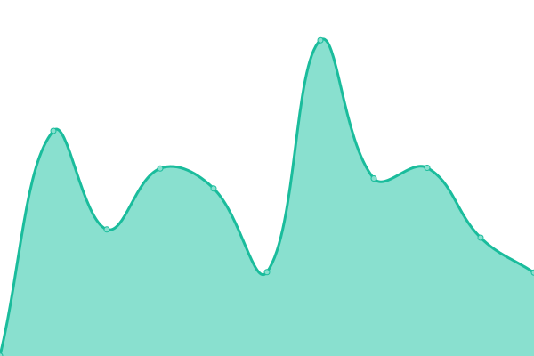
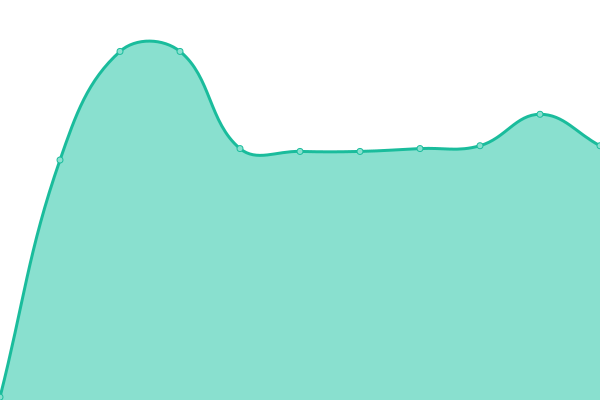

# [📈 Live Status](https://status.playerdata.co.uk): <!--live status--> **🟩 All systems operational**

This repository contains the open-source uptime monitor and status page for [PlayerData](https://www.playerdata.co.uk) services, powered by [Upptime](https://github.com/upptime/upptime).

<!--start: status pages-->
<!-- This summary is generated by Upptime (https://github.com/upptime/upptime) -->
<!-- Do not edit this manually, your changes will be overwritten -->

| URL                                                         | Status | History                                                                                                                   | Response Time                                                                            | Uptime                                                                                                                                                                                                                                            |
| ----------------------------------------------------------- | ------ | ------------------------------------------------------------------------------------------------------------------------- | ---------------------------------------------------------------------------------------- | ------------------------------------------------------------------------------------------------------------------------------------------------------------------------------------------------------------------------------------------------- |
| [PlayerData API](https://app.playerdata.co.uk/api/liveness) | 🟩 Up  | [player-data-api.yml](https://github.com/PlayerData/playerdata-status/commits/master/history/player-data-api.yml)         |  860ms     |           |
| [PlayerData Web App](https://app.playerdata.co.uk)          | 🟩 Up  | [player-data-web-app.yml](https://github.com/PlayerData/playerdata-status/commits/master/history/player-data-web-app.yml) |  96ms  |  |
| [PlayerData Website](https://www.playerdata.co.uk)          | 🟩 Up  | [player-data-website.yml](https://github.com/PlayerData/playerdata-status/commits/master/history/player-data-website.yml) |  349ms |  |

<!--end: status pages-->

[**Visit our status website →**](https://status.playerdata.co.uk)

## 📄 License

- Code: [MIT](./LICENSE) © [PlayerData Holdings Ltd](https://www.playerdata.co.uk)
- Data in the `./history` directory: [Open Database License](https://opendatacommons.org/licenses/odbl/1-0/)
