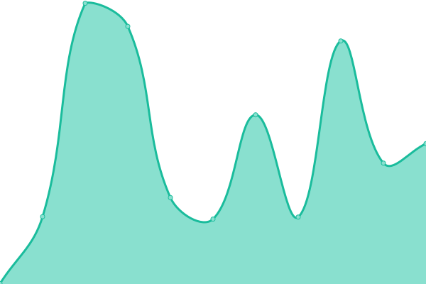

# [📈 Live Status](https://ball-hayden.github.io/playerdata-status): <!--live status--> **🟩 All systems operational**

This repository contains the open-source uptime monitor and status page for [Hayden Ball](www.haydenball.me.uk), powered by [Upptime](https://github.com/upptime/upptime).

With [Upptime](https://upptime.js.org), you can get your own unlimited and free uptime monitor and status page, powered entirely by a GitHub repository. We use [Issues](https://github.com/ball-hayden/playerdata-status/issues) as incident reports, [Actions](https://github.com/ball-hayden/playerdata-status/actions) as uptime monitors, and [Pages](https://ball-hayden.github.io/playerdata-status) for the status page.

<!--start: status pages-->
<!-- This summary is generated by Upptime (https://github.com/upptime/upptime) -->
<!-- Do not edit this manually, your changes will be overwritten -->

| URL                                                         | Status | History                                                                                                                    | Response Time                                                                            | Uptime                                                                                                                                                                                                                                                            |
| ----------------------------------------------------------- | ------ | -------------------------------------------------------------------------------------------------------------------------- | ---------------------------------------------------------------------------------------- | ----------------------------------------------------------------------------------------------------------------------------------------------------------------------------------------------------------------------------------------------------------------- |
| [PlayerData API](https://app.playerdata.co.uk/api/liveness) | 🟩 Up  | [player-data-api.yml](https://github.com/ball-hayden/playerdata-status/commits/master/history/player-data-api.yml)         |  652ms     |          |
| [PlayerData Web App](https://app.playerdata.co.uk)          | 🟩 Up  | [player-data-web-app.yml](https://github.com/ball-hayden/playerdata-status/commits/master/history/player-data-web-app.yml) |  85ms  |  |
| [PlayerData Website](https://www.playerdata.co.uk)          | 🟩 Up  | [player-data-website.yml](https://github.com/ball-hayden/playerdata-status/commits/master/history/player-data-website.yml) |  116ms |  |

<!--end: status pages-->

[**Visit our status website →**](https://ball-hayden.github.io/playerdata-status)

## 📄 License

- Code: [MIT](./LICENSE) © [Hayden Ball](www.haydenball.me.uk)
- Data in the `./history` directory: [Open Database License](https://opendatacommons.org/licenses/odbl/1-0/)
